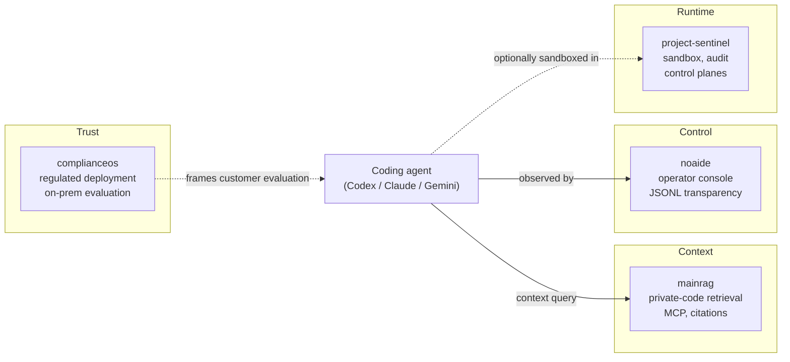
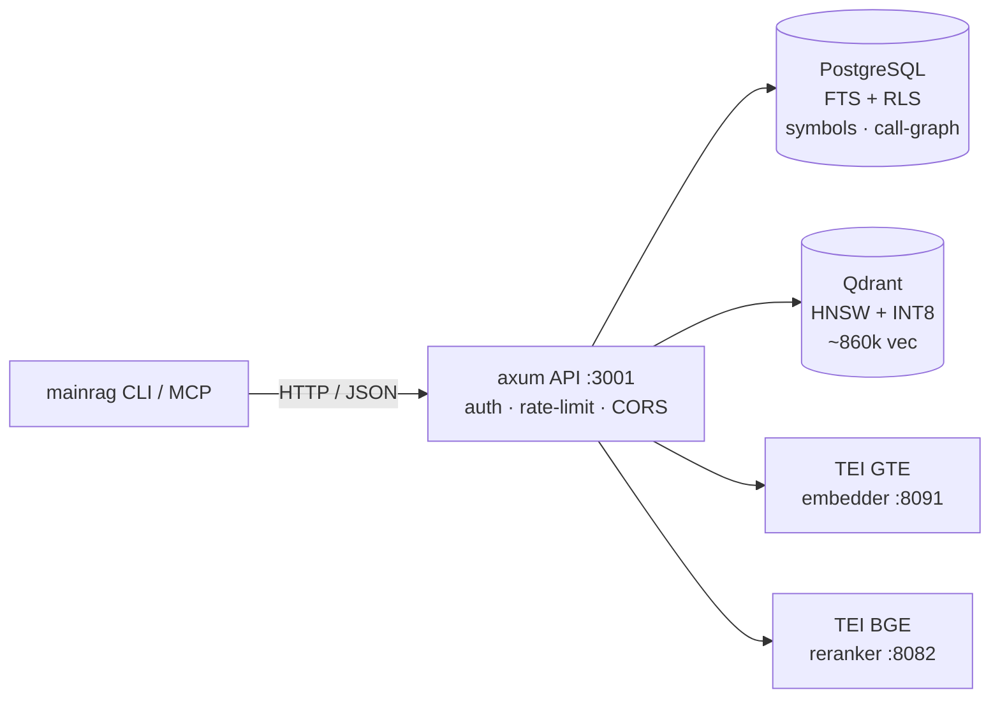

# MainRag

> **Self-hosted context layer for AI coding agents.** MainRag exposes
> private repositories, docs, and prior agent conversations to coding
> agents (Codex, Claude Code, ...) through MCP — with citations and
> tenant boundaries.
>
> Coding agents query the right files first time, with citations, on
> the customer's own infrastructure.
>
> Under the hood (technical): PostgreSQL FTS + Qdrant (HNSW + INT8)
> + GTE-ModernBERT embeddings + cross-encoder reranking + code
> intelligence (symbols, call-graph, N-hop traversal).

[](LICENSE)
[](docs/search-baseline-gte-modernbert.md)
[](data/benchmarks/)
[](Cargo.toml)

MainRag is a self-hosted retrieval backend that turns a heterogeneous corpus
(source code, Markdown docs, PDFs, web crawls, chat transcripts) into a
queryable knowledge base. It is built for LLM agents and human developers
who need *grounded, citable, low-latency* answers over large private codebases
(~860k chunks tested) without sending data to a third party.

- **Embedding model:** `Alibaba-NLP/gte-modernbert-base` (768d, 8192-token context)
- **Reranker:** `BAAI/bge-reranker-base` (cross-encoder)
- **Vector store:** Qdrant 1.16 with HNSW + Scalar Quantization (INT8)
- **Lexical index:** PostgreSQL 18 FTS (GIN, `UNION ALL simple+english`)
- **Intelligence layer:** Tree-sitter symbol extraction, call-graph edges, N-hop BFS traversal

> Last verified: 2026-04-24 via commit `2d597cb`

## In a Codex rollout

A typical customer scenario:

- **Customer infrastructure:** mainrag runs on the customer's own
  servers (PostgreSQL + Qdrant + TEI). No source code, retrieval
  index, or query history leaves their network.
- **Private repository ingestion:** the admin source endpoint
  (`POST /api/v1/admin/sources` + `/sync`) indexes the customer's
  monorepo, internal docs, prior agent conversations, and design
  tickets.
- **Codex via MCP:** Codex (or any MCP-aware coding agent) connects
  to mainrag's MCP endpoint (`/api/v1/mcp/tools`). When the agent
  needs context, it calls `search_code`, `find_callers`,
  `get_symbol_card` — results come back with citations to specific
  files and lines.
- **Cited PR review:** the agent's proposed patch references the
  same citations. Reviewers can re-open the retrieval results, see
  what the agent saw, and verify whether the change is grounded in
  the right context.

> ▶ **3-minute MCP demo:** [`docs/demo-mcp-codex.md`](docs/demo-mcp-codex.md)
>
> What you see in the cast: `docker compose up` → 3 services healthy
> → 13 MCP tools listed → `search_code` returns a cited result →
> mainrag-CLI search hits the same backend → closing one-liner.

Pairs with [noaide](https://github.com/silentspike/noaide) for the
operator console: mainrag provides context; noaide provides
supervision and audit.

## MCP for AI coding agents

MainRag ships a Model Context Protocol server alongside the HTTP API.
Coding agents on private codebases need grounded retrieval over the
company repository, not just the open files — MainRag is that retrieval
layer. 13 tools are exposed live under `/api/v1/mcp/tools` (list) and
`/api/v1/mcp/tools/execute` (call):

| Tool | Purpose |
| --- | --- |
| `search_code` | Hybrid retrieval over indexed sources with citations |
| `search_symbols` | Identifier-aware lookup (functions, types, methods) |
| `find_callers` / `find_callees` | Call-graph navigation (1..N hops) |
| `get_symbol_callgraph` / `get_symbol_card` | Symbol-centric context bundles |
| `explain_path` | Why was this chunk retrieved? (signal breakdown) |
| `list_sources` / `get_source_stats` | Inventory of indexed corpora |
| `browse_layers` / `explore` / `get_ownership` / `report_dead_end` | Agent-driven exploration |

End-to-end demo (3 minutes from `docker compose up` to a Codex patch):
[`docs/demo-mcp-codex.md`](docs/demo-mcp-codex.md).

## Why MainRag

Pure vector search overfits to paraphrase. Pure keyword search misses
synonyms. Most hybrid stacks stop at RRF. MainRag adds:

1. **Multi-signal ranking:** RRF (BM25 + vector) + call-graph popularity +
   symbol-expansion (identifier tokenization) + parent-context boosting.
2. **UNION ALL FTS:** the `simple` and `english` tsvector configurations run
   in parallel; identifier substrings (`hybrid_search`) and natural-language
   queries (`how to delete a clip`) both hit.
3. **Cross-encoder rerank:** top-N from hybrid fusion is re-scored by a
   ModernBERT cross-encoder before being returned.
4. **Code intelligence, not just text:** tree-sitter parses 25+ languages
   into symbols, edges are stored as a proper graph, and N-hop call chains
   are reachable via a single API call.

Coding agents on private codebases need grounded retrieval over the
company repository, not just the open files. MainRag is that retrieval
layer — citable, tenant-bounded, fully self-hosted.

Pairs with [noaide](https://github.com/silentspike/noaide) — context
(mainrag) + control (noaide) for coding agents.

## How it fits with the rest of the stack

mainrag is the **context** layer in a four-pillar stack for AI coding
agents in regulated environments:



- [mainrag](https://github.com/silentspike/mainrag) answers: *what context does the agent need?*
- [noaide](https://github.com/silentspike/noaide) answers: *what is the agent doing right now?*
- [project-sentinel](https://github.com/silentspike/project-sentinel) answers: *what runtime boundaries enforce safety?*
- [complianceos](https://github.com/silentspike/complianceos) answers: *how does a regulated customer evaluate this?*

## Performance

Measured on a single workstation (AMD Ryzen 9 5900HS, RTX 3050 Ti 4 GB, 16 GB RAM),
corpus size 859k chunks, 10 canonical queries × 3 repetitions (n=30, wall-clock
including CLI startup overhead ~30–50 ms).

| Metric        | Value  |
| ------------- | ------ |
| **p50**       | 132 ms |
| **p95**       | 187 ms |
| **p99**       | 208 ms |
| mean ± stdev  | 131 ± 36 ms |
| min / max     | 68 / 213 ms |

Evidence: [`data/benchmarks/search_latency_20260424T140514Z.json`](data/benchmarks/search_latency_20260424T140514Z.json),
script: [`scripts/benchmark-search.py`](scripts/benchmark-search.py).

### Quality baseline (early public preview)

Relevance is tracked through a small, manually curated 10-query
reference set, with each top-5 result rated GOOD / PARTIAL / WEAK
by hand. This is **not a production benchmark** — it is the
internal regression set used during the alpha cycle. A larger,
publicly reproducible eval is on the v0.2-beta roadmap.

| Model                          | GOOD | PARTIAL | WEAK |
| ------------------------------ | ---- | ------- | ---- |
| `BAAI/bge-base-en-v1.5`        | 50 % | 20 %    | 30 % |
| `Alibaba-NLP/gte-modernbert-base` | **70 %** (+20 pp) | 20 % | 10 % |

Evidence: [`docs/search-baseline-bge-base.md`](docs/search-baseline-bge-base.md),
[`docs/search-baseline-gte-modernbert.md`](docs/search-baseline-gte-modernbert.md).

## Capabilities at a glance

Honest status per area, in four buckets — *Implemented* (code on
main + tests in CI), *Demo-backed* (code on main + a recorded
walkthrough or fixture), *Partial* (code on main but a polish or
hardening gap remains), *Roadmap* (an open issue, no code yet).

| Capability | Status |
| --- | --- |
| Hybrid retrieval (BM25 + vector + cross-encoder rerank) | Implemented |
| MCP server (13 tools live under `/api/v1/mcp/tools`) | Implemented |
| Code intelligence (tree-sitter, 25+ languages) | Implemented |
| Call-graph + N-hop BFS traversal | Implemented |
| Watch-mode (incremental re-indexing) | Implemented |
| RLS + JWT + rate-limit + pepper-hashed API keys | Implemented |
| Performance baseline (Recall@10 70 %, p50 132 ms) | Demo-backed (`data/benchmarks/`) |
| MCP demo walkthrough | Demo-backed (`docs/demo-mcp-codex.md`, `docs/images/mcp-codex-demo.gif`) |
| Multi-tenant isolation | Partial (RLS on `sources` / `files` / `chunks`; `symbols` / `call_graph_edges` and `DEFAULT_USER_ID` outbox are v0.2 work — see [#10](https://github.com/silentspike/mainrag/issues/10)) |
| Multi-tenant beta hardening | Roadmap ([#10](https://github.com/silentspike/mainrag/issues/10), scoped for v0.2-beta) |

## Architecture at a glance



<details>
<summary>Terminal-readable ASCII variant</summary>

```
                      ┌────────────────────────────┐
                      │    mainrag CLI / MCP       │
                      └─────────────┬──────────────┘
                                    │ HTTP / JSON
                      ┌─────────────▼──────────────┐
                      │    axum API  (port 3001)   │
                      │  auth · rate-limit · CORS  │
                      └──┬──────────────────────┬──┘
                         │                      │
     ┌───────────────────┼──────────────────────┼───────────────────┐
     │                   │                      │                   │
┌────▼────┐        ┌─────▼─────┐         ┌──────▼──────┐      ┌─────▼─────┐
│PostgreSQL│        │  Qdrant   │         │  TEI GTE   │      │ TEI BGE   │
│FTS + RLS │        │HNSW + INT8│         │  Embedder  │      │ Reranker  │
│ symbols  │        │ 860k vec  │         │  :8091     │      │  :8082    │
│callgraph │        │           │         │            │      │           │
└──────────┘        └───────────┘         └────────────┘      └───────────┘
```

</details>

Full diagram and data-flow: [`docs/architecture.md`](docs/architecture.md).

## Quickstart

> Requires: Docker + nvidia-container-toolkit, PostgreSQL 18, Rust 1.75+.

```bash
# 1. Build workspace
cargo build --release --workspace

# 2. Start embedder + reranker + Qdrant
docker compose up -d

# 3. Apply schema
psql "$DATABASE_URL" -f schema_intelligence.sql

# 4. Run the API
./target/release/mainrag-api

# 5. From another shell: register a source via the admin API,
#    sync it, then search
TOKEN=$(curl -sf -X POST http://localhost:3001/api/v1/auth/login \
  -H "Content-Type: application/json" \
  -d '{"username":"admin","password":"<your-admin-password>"}' | jq -r .token)
SRC_ID=$(curl -sf -X POST http://localhost:3001/api/v1/admin/sources \
  -H "Authorization: Bearer $TOKEN" -H "Content-Type: application/json" \
  -d '{"name":"my-repo","source_type":"fs","path":"./path/to/code"}' | jq -r .id)
curl -sf -X POST "http://localhost:3001/api/v1/admin/sources/$SRC_ID/sync" \
  -H "Authorization: Bearer $TOKEN" | jq '.status'
./target/release/mainrag search "how does hybrid_search work"
```

See [`docs/operations.md`](docs/operations.md) for deployment, service
topology, model requirements (~600 MB for GTE embedder + reranker), and
`mainrag.env` reference.

## Features

- **Hybrid retrieval** — BM25 ⊕ vector ⊕ cross-encoder rerank. See [`docs/architecture.md`](docs/architecture.md).
- **Code intelligence** — symbol extraction (25+ languages via tree-sitter), call-graph with N-hop BFS. See [`docs/intelligence.md`](docs/intelligence.md).
- **HTTP API + MCP server** — axum on `:3001`, MCP tools for Claude/agents. See [`docs/api.md`](docs/api.md).
- **Watch mode** — incremental re-indexing on file changes, PDF/export/git/web plugins.
- **Security** — Row-Level-Security on PostgreSQL, dual-key JWT rotation, rate limiting, pepper-hashed API keys, request-size limits, security headers.

## Repository layout

```
.
├── api/            Rust axum server + retrieval pipeline + intelligence
├── cli/            Rust CLI (mainrag binary)
├── docs/           Public docs (architecture, api, operations, intelligence) + baselines
├── ops/            systemd units, migration/backup infrastructure
├── scripts/        Python utilities (benchmark, migration, enrichment)
├── data/           Benchmark artifacts (gitignored except JSON results)
├── docker-compose.yml
├── schema_intelligence.sql
└── Cargo.toml      workspace root
```

## Documentation

| Doc | Scope |
| --- | --- |
| [`docs/architecture.md`](docs/architecture.md) | System components, data flow, ranking pipeline |
| [`docs/api.md`](docs/api.md) | HTTP endpoints, auth, request/response shapes |
| [`docs/operations.md`](docs/operations.md) | Deployment, services, env vars, health checks |
| [`docs/intelligence.md`](docs/intelligence.md) | Call-graph, N-hop traversal, symbol cards |
| [`docs/search-baseline-gte-modernbert.md`](docs/search-baseline-gte-modernbert.md) | Current relevance evidence (10 queries) |
| [`docs/search-baseline-bge-base.md`](docs/search-baseline-bge-base.md) | Prior BGE baseline (historical) |
| [`docs/demo-mcp-codex.md`](docs/demo-mcp-codex.md) | 3-minute MCP/Codex demo walkthrough |
| [`examples/`](examples/) | Copy-pasteable walkthroughs (index OSS repo · call MCP tools · agent with context) |

The repository's social preview (the image GitHub renders when the
repo is shared) lives at
[`docs/images/og-preview.png`](docs/images/og-preview.png) and is
reproducible from
[`docs/images/og-preview.source.html`](docs/images/og-preview.source.html).
Uploading it is a manual maintainer step under *Settings → General →
Social preview* — GitHub does not expose a REST endpoint for that
upload.

## Status

This is an early public preview (`v0.1.0-alpha.1`). The system runs
production traffic on a single node but public-facing APIs, CI, and the
plugin interface are not yet stabilized. Expect breaking changes.

**Not for production multi-tenant use.** MainRag v0.1.0-alpha is a
single-tenant developer preview. The transactional outbox and the
`DEFAULT_USER_ID` hardening are scoped for v0.2 (multi-tenant beta) —
see [#10](https://github.com/silentspike/mainrag/issues/10) for the
plan.

MainRag is developed using AI coding agents — the same tools it
serves with private-code context.

## License

Licensed under the Apache License, Version 2.0. See [`LICENSE`](LICENSE).

<!-- Owned governance enforcement probe; removed before acceptance. -->
[Controlled required-check failure](docs/governance-required-check-negative-fixture.md)
